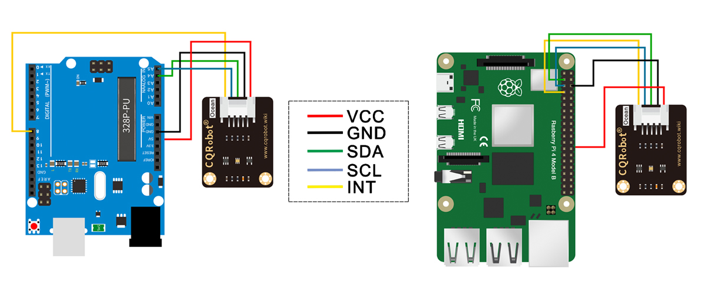

# Raspberry PI Lux Sensor API

This repository contains a Fastify API server that reads lux values from a light sensor connected to a Raspberry PI.

## Prerequisites

- Raspberry PI (Tested with 4 Model B)
- Light sensor module [cqrobot wiki TSL2491X_Light_Sensor](http://www.cqrobot.wiki/index.php/TSL2591X_Light_Sensor)
- Node.js and npm installed on the Raspberry pi

## Installation

1. Clone this repo to your Raspberry PI:

```bash
git clone https://github.com/DeTonti-Bunker/lux-api.git
```

2. Install dependencies:

```bash
npm ci
```

3. Start the server:

```bash
npm run start
```

4. Test the API (returns the current lux value from the light sensor):

```bash
curl http://localhost:3000/lux
```

```json
{
  "lux": 44000
}
```

## API Endpoints

- `GET /lux`: Returns the current lux value from the light sensor

```json
{
  "lux": 44000
}
```

- `GET /lux/max`: Returns the maximum lux value possible.

```json
{
  "lux": 88000
}
```

- `GET /lux/min`: Returns the minimum lux value possible.

```json
{
  "lux": 0
}
```

## Hardware Setup



Refer to the instructions:

- Light sensor module [cqrobot wiki TSL2491X_Light_Sensor](http://www.cqrobot.wiki/index.php/TSL2591X_Light_Sensor)
